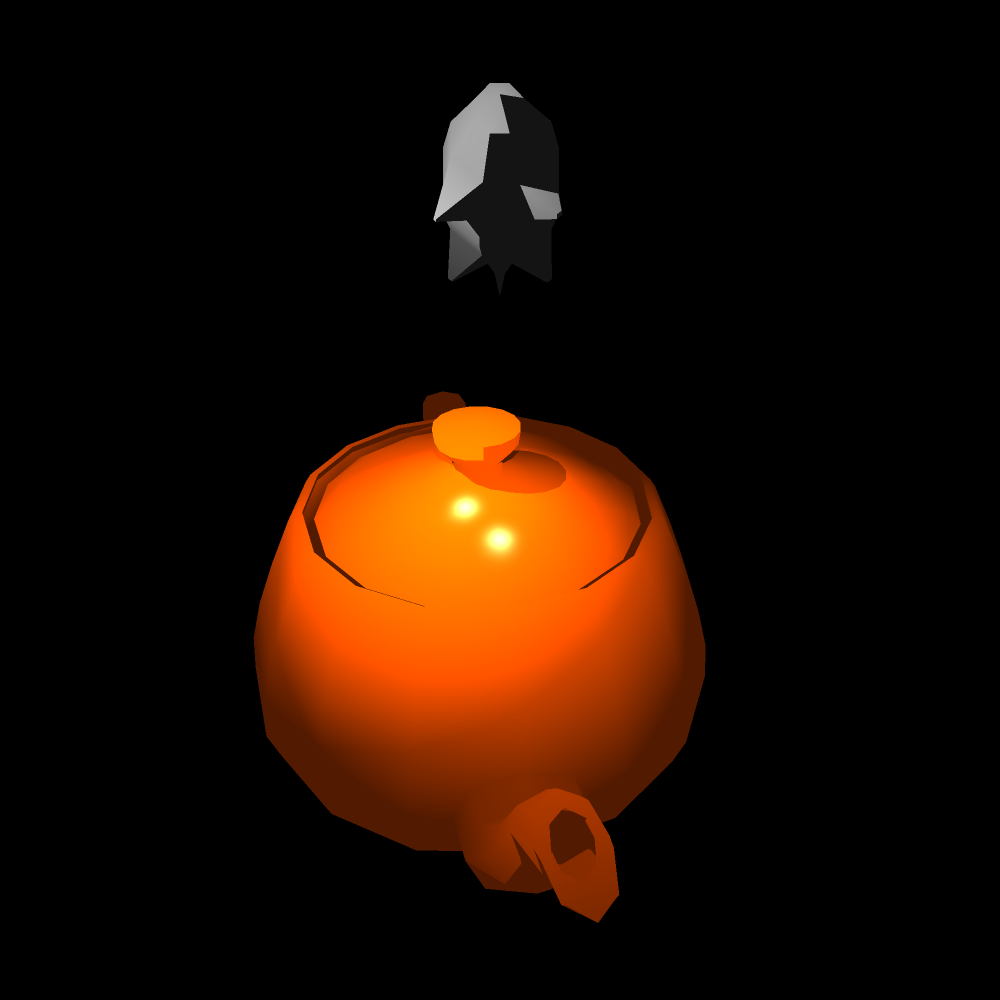

# Raytracer from Scratch

This is the repository for the software project in winter semester 24/25 at Ulm University of Applied Sciences (THU) developed by team "Rayrangers".
"Raytracer from Scratch" is an educational project designed to generate realistic-looking images from 3D models using raytracing techniques. Users are able to customize all elements within a scene, including models, cameras, and light sources.

    

## Documentation

Anything related to product documentation can be found in our [Wiki](https://github.com/Rayrangers/SOPR_WS24_25-Raytracers/wiki).

Additionally, a GitHub Action automatically generates and deploys an up-to-date [API documentation](https://rayrangers.github.io/SOPR_WS24_25-Raytracers/raytracer/apidocs/) based on the javadoc in the code.

## Licence

This project is licensed under the GPU GPLv3 license. The specific license information can be found [here](LICENSE).
